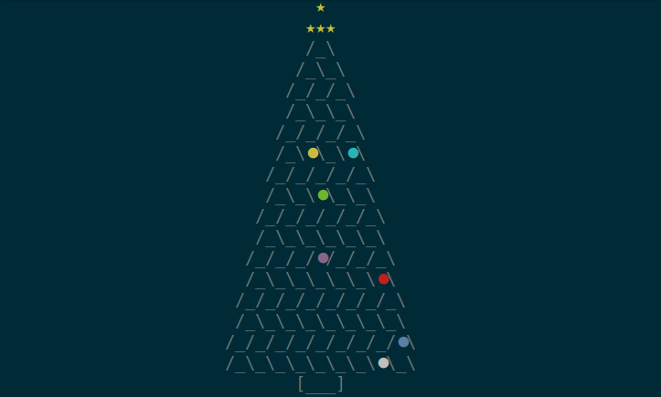

# Python Christmas Tree



A simple CLI Christmas tree made with Python

## Installation

Just clone the repository and run

```
$ python terminal_tree.py
```

More options below.

## Usage

The script name is `terminal_tree.py` and it accepts the following syntax according to its `--help`:

```
$ python terminal_tree.py -h

usage: Python Christmas Tree by Chico Lucio from Ciencia Programada
       [-h] [-s SIZE] [-w WIDTH] [-t]

optional arguments:
  -h, --help            show this help message and exit
  -s SIZE, --size SIZE  Tree height. If even it will be subtracted 1. If less
                        than 7, considered 5. Default: 13
  -w WIDTH, --width WIDTH
                        Screen width. Used to center the tree. Default: 80
  -t, --terminal        Uses the terminal size to center the tree. -s and -w
                        will be ignored

Ctrl-C interrupts the Christmas :-(
```

## Contributing

All contributions are welcome.

**Issues**

Feel free to submit issues regarding:

- recommendations
- more examples for the README
- enhancement requests and new useful features
- code bugs

**Pull requests**

- before starting to work on your pull request, please submit an issue first
- fork the repo
- clone the project to your own machine
- commit changes to your own branch
- push your work back up to your fork
- submit a pull request so that your changes can be reviewed


## License

MIT, see [LICENSE](LICENSE)

## Citing

If you use *terminal-christmas-tree*, please consider citing as

F. L. S. Bustamante, *terminal-christmas-tree*, 2020 - Available at: https://github.com/chicolucio/terminal-christmas-tree